[← Python](../README.md)

# Pandas Solutions

The database track, solved with pandas: merges, `groupby` aggregation, filtering on grouped results, and reshaping DataFrames into the answer. Every entry pairs the accepted code with a short approach: the idea first, then the steps, the complexity, and the measured runtime.

## Progress

<!-- LEETCODE_SYNC_STATS_START -->

### Topics covered

<!-- LEETCODE_SYNC_STATS_END -->

## Problems

<!-- LEETCODE_SYNC_TABLE_START -->

| # | Problem | Difficulty | Topics | Solution | Syncs | Updated |
|:---:|:---:|:---:|:---:|:---:|:---:|:---:|
| 595 | [Big Countries](https://leetcode.com/problems/big-countries/) | Easy | Database | [approach](0595-big-countries/README.md)&nbsp;·&nbsp;[code](0595-big-countries/0595-big-countries.py) | 2 | Jul&nbsp;6,&nbsp;2026 |

<b>Syncs</b> = accepted pushes for that problem, so a re-solve bumps it.

<!-- LEETCODE_SYNC_TABLE_END -->

Every row is an accepted submission. Open the approach for the reasoning, not just the code — future you will thank present you.
