# LeetCode Solutions

Accepted [LeetCode](https://leetcode.com) solutions, each written up step by step: the idea that cracks the problem, the code, the complexity, and the runtime it clocked. Start with a language folder under Progress, or open the full problem index below.

## Progress

<!-- LEETCODE_SYNC_STATS_START -->




### By language

| Folder | Problems | Easy | Medium | Hard | Last updated |
|:---:|:---:|:---:|:---:|:---:|:---:|
| [Python](Python/README.md) | 11 | 9 | 2 | 0 | Jul&nbsp;9,&nbsp;2026 |
| [SQL](SQL/README.md) | 10 | 10 | 0 | 0 | Jul&nbsp;9,&nbsp;2026 |

<details>
<summary><b>By topic</b> · 1 topic</summary>

| Topic | Solved | Easy | Medium | Hard | Problems |
|:--|:--:|:--:|:--:|:--:|:--|
| **Database** | 21 | 19 | 2 | 0 | [176. Second Highest Salary](Python/Pandas/0176-second-highest-salary/README.md), [177. Nth Highest Salary](Python/Pandas/0177-nth-highest-salary/README.md), [183. Customers Who Never Order](Python/Pandas/0183-customers-who-never-order/README.md), [197. Rising Temperature](SQL/0197-rising-temperature/README.md), [584. Find Customer Referee](SQL/0584-find-customer-referee/README.md), [595. Big Countries](Python/Pandas/0595-big-countries/README.md), [595. Big Countries](SQL/0595-big-countries/README.md), [1068. Product Sales Analysis I](SQL/1068-product-sales-analysis-i/README.md), [1148. Article Views I](Python/Pandas/1148-article-views-i/README.md), [1148. Article Views I](SQL/1148-article-views-i/README.md), [1378. Replace Employee ID With The Unique Identifier](SQL/1378-replace-employee-id-with-the-unique-identifier/README.md), [1517. Find Users With Valid E-Mails](Python/Pandas/1517-find-users-with-valid-e-mails/README.md), [1527. Patients With a Condition](Python/Pandas/1527-patients-with-a-condition/README.md), [1581. Customer Who Visited but Did Not Make Any Transactions](SQL/1581-customer-who-visited-but-did-not-make-any-transactions/README.md), [1661. Average Time of Process per Machine](SQL/1661-average-time-of-process-per-machine/README.md), [1667. Fix Names in a Table](Python/Pandas/1667-fix-names-in-a-table/README.md), [1683. Invalid Tweets](Python/Pandas/1683-invalid-tweets/README.md), [1683. Invalid Tweets](SQL/1683-invalid-tweets/README.md), [1757. Recyclable and Low Fat Products](Python/Pandas/1757-recyclable-and-low-fat-products/README.md), [1757. Recyclable and Low Fat Products](SQL/1757-recyclable-and-low-fat-products/README.md), [1873. Calculate Special Bonus](Python/Pandas/1873-calculate-special-bonus/README.md) |

</details>
<!-- LEETCODE_SYNC_STATS_END -->

## Problems

<!-- LEETCODE_SYNC_TABLE_START -->
<details>
<summary><b>All 21 problems</b></summary>

| # | Problem | Difficulty | Topics | Language | Solution | Syncs | Updated |
|:---:|:---:|:---:|:---:|:---:|:---:|:---:|:---:|
| 176 | [Second Highest Salary](https://leetcode.com/problems/second-highest-salary/) | Medium | Database | Python · Pandas | [approach](Python/Pandas/0176-second-highest-salary/README.md)&nbsp;·&nbsp;[code](Python/Pandas/0176-second-highest-salary/0176-second-highest-salary.py) | 1 | Jul&nbsp;9,&nbsp;2026 |
| 177 | [Nth Highest Salary](https://leetcode.com/problems/nth-highest-salary/) | Medium | Database | Python · Pandas | [approach](Python/Pandas/0177-nth-highest-salary/README.md)&nbsp;·&nbsp;[code](Python/Pandas/0177-nth-highest-salary/0177-nth-highest-salary.py) | 1 | Jul&nbsp;9,&nbsp;2026 |
| 183 | [Customers Who Never Order](https://leetcode.com/problems/customers-who-never-order/) | Easy | Database | Python · Pandas | [approach](Python/Pandas/0183-customers-who-never-order/README.md)&nbsp;·&nbsp;[code](Python/Pandas/0183-customers-who-never-order/0183-customers-who-never-order.py) | 1 | Jul&nbsp;7,&nbsp;2026 |
| 197 | [Rising Temperature](https://leetcode.com/problems/rising-temperature/) | Easy | Database | SQL | [approach](SQL/0197-rising-temperature/README.md)&nbsp;·&nbsp;[code](SQL/0197-rising-temperature/0197-rising-temperature.sql) | 2 | Jul&nbsp;9,&nbsp;2026 |
| 584 | [Find Customer Referee](https://leetcode.com/problems/find-customer-referee/) | Easy | Database | SQL | [approach](SQL/0584-find-customer-referee/README.md)&nbsp;·&nbsp;[code](SQL/0584-find-customer-referee/0584-find-customer-referee.sql) | 1 | Jul&nbsp;5,&nbsp;2026 |
| 595 | [Big Countries](https://leetcode.com/problems/big-countries/) | Easy | Database | Python · Pandas | [approach](Python/Pandas/0595-big-countries/README.md)&nbsp;·&nbsp;[code](Python/Pandas/0595-big-countries/0595-big-countries.py) | 2 | Jul&nbsp;6,&nbsp;2026 |
| 595 | [Big Countries](https://leetcode.com/problems/big-countries/) | Easy | Database | SQL | [approach](SQL/0595-big-countries/README.md)&nbsp;·&nbsp;[code](SQL/0595-big-countries/0595-big-countries.sql) | 1 | Jul&nbsp;6,&nbsp;2026 |
| 1068 | [Product Sales Analysis I](https://leetcode.com/problems/product-sales-analysis-i/) | Easy | Database | SQL | [approach](SQL/1068-product-sales-analysis-i/README.md)&nbsp;·&nbsp;[code](SQL/1068-product-sales-analysis-i/1068-product-sales-analysis-i.sql) | 1 | Jul&nbsp;6,&nbsp;2026 |
| 1148 | [Article Views I](https://leetcode.com/problems/article-views-i/) | Easy | Database | Python · Pandas | [approach](Python/Pandas/1148-article-views-i/README.md)&nbsp;·&nbsp;[code](Python/Pandas/1148-article-views-i/1148-article-views-i.py) | 1 | Jul&nbsp;7,&nbsp;2026 |
| 1148 | [Article Views I](https://leetcode.com/problems/article-views-i/) | Easy | Database | SQL | [approach](SQL/1148-article-views-i/README.md)&nbsp;·&nbsp;[code](SQL/1148-article-views-i/1148-article-views-i.sql) | 1 | Jul&nbsp;6,&nbsp;2026 |
| 1378 | [Replace Employee ID With The Unique Identifier](https://leetcode.com/problems/replace-employee-id-with-the-unique-identifier/) | Easy | Database | SQL | [approach](SQL/1378-replace-employee-id-with-the-unique-identifier/README.md)&nbsp;·&nbsp;[code](SQL/1378-replace-employee-id-with-the-unique-identifier/1378-replace-employee-id-with-the-unique-identifier.sql) | 1 | Jul&nbsp;6,&nbsp;2026 |
| 1517 | [Find Users With Valid E-Mails](https://leetcode.com/problems/find-users-with-valid-e-mails/) | Easy | Database | Python · Pandas | [approach](Python/Pandas/1517-find-users-with-valid-e-mails/README.md)&nbsp;·&nbsp;[code](Python/Pandas/1517-find-users-with-valid-e-mails/1517-find-users-with-valid-e-mails.py) | 1 | Jul&nbsp;8,&nbsp;2026 |
| 1527 | [Patients With a Condition](https://leetcode.com/problems/patients-with-a-condition/) | Easy | Database | Python · Pandas | [approach](Python/Pandas/1527-patients-with-a-condition/README.md)&nbsp;·&nbsp;[code](Python/Pandas/1527-patients-with-a-condition/1527-patients-with-a-condition.py) | 2 | Jul&nbsp;8,&nbsp;2026 |
| 1581 | [Customer Who Visited but Did Not Make Any Transactions](https://leetcode.com/problems/customer-who-visited-but-did-not-make-any-transactions/) | Easy | Database | SQL | [approach](SQL/1581-customer-who-visited-but-did-not-make-any-transactions/README.md)&nbsp;·&nbsp;[code](SQL/1581-customer-who-visited-but-did-not-make-any-transactions/1581-customer-who-visited-but-did-not-make-any-transactions.sql) | 1 | Jul&nbsp;6,&nbsp;2026 |
| 1661 | [Average Time of Process per Machine](https://leetcode.com/problems/average-time-of-process-per-machine/) | Easy | Database | SQL | [approach](SQL/1661-average-time-of-process-per-machine/README.md)&nbsp;·&nbsp;[code](SQL/1661-average-time-of-process-per-machine/1661-average-time-of-process-per-machine.sql) | 2 | Jul&nbsp;9,&nbsp;2026 |
| 1667 | [Fix Names in a Table](https://leetcode.com/problems/fix-names-in-a-table/) | Easy | Database | Python · Pandas | [approach](Python/Pandas/1667-fix-names-in-a-table/README.md)&nbsp;·&nbsp;[code](Python/Pandas/1667-fix-names-in-a-table/1667-fix-names-in-a-table.py) | 1 | Jul&nbsp;8,&nbsp;2026 |
| 1683 | [Invalid Tweets](https://leetcode.com/problems/invalid-tweets/) | Easy | Database | Python · Pandas | [approach](Python/Pandas/1683-invalid-tweets/README.md)&nbsp;·&nbsp;[code](Python/Pandas/1683-invalid-tweets/1683-invalid-tweets.py) | 1 | Jul&nbsp;8,&nbsp;2026 |
| 1683 | [Invalid Tweets](https://leetcode.com/problems/invalid-tweets/) | Easy | Database | SQL | [approach](SQL/1683-invalid-tweets/README.md)&nbsp;·&nbsp;[code](SQL/1683-invalid-tweets/1683-invalid-tweets.sql) | 1 | Jul&nbsp;6,&nbsp;2026 |
| 1757 | [Recyclable and Low Fat Products](https://leetcode.com/problems/recyclable-and-low-fat-products/) | Easy | Database | Python · Pandas | [approach](Python/Pandas/1757-recyclable-and-low-fat-products/README.md)&nbsp;·&nbsp;[code](Python/Pandas/1757-recyclable-and-low-fat-products/1757-recyclable-and-low-fat-products.py) | 1 | Jul&nbsp;7,&nbsp;2026 |
| 1757 | [Recyclable and Low Fat Products](https://leetcode.com/problems/recyclable-and-low-fat-products/) | Easy | Database | SQL | [approach](SQL/1757-recyclable-and-low-fat-products/README.md)&nbsp;·&nbsp;[code](SQL/1757-recyclable-and-low-fat-products/1757-recyclable-and-low-fat-products.sql) | 1 | Jul&nbsp;5,&nbsp;2026 |
| 1873 | [Calculate Special Bonus](https://leetcode.com/problems/calculate-special-bonus/) | Easy | Database | Python · Pandas | [approach](Python/Pandas/1873-calculate-special-bonus/README.md)&nbsp;·&nbsp;[code](Python/Pandas/1873-calculate-special-bonus/1873-calculate-special-bonus.py) | 1 | Jul&nbsp;8,&nbsp;2026 |

<sub><b>Syncs</b> = accepted pushes for that problem, so a re-solve bumps it.</sub>

</details>
<!-- LEETCODE_SYNC_TABLE_END -->

## Inside a problem folder

Every problem follows the same shape:

```text
SQL/1757-recyclable-and-low-fat-products/
├── README.md                                   the approach: idea, steps, complexity, runtime
└── 1757-recyclable-and-low-fat-products.sql    the exact code LeetCode accepted
```

Each approach opens with the idea that cracks the problem, walks through the code in numbered steps, and records the complexity and measured runtime, with the full statement collapsed at the end.

## How to use this repo

- **Revisiting a topic** — scan the Topics column in the problem index; each approach leads with the one idea worth remembering, so a skim rebuilds intuition fast.
- **Before an interview** — reread the approach notes instead of code. If the summary alone brings it back, move on; if not, that problem is due for a re-solve.
- **Spotting weak areas** — the Syncs column shows which problems took several attempts, and the per-language cards make lopsided difficulty splits obvious at a glance.
- **Tracking momentum** — the progress card, badges, and folder table refresh with every accepted submission, in the same commit as the code they describe.

---

<sub>Maintained automatically: each accepted submission lands as one commit containing the code, its approach, and every index shown above.</sub>
