[← All problems](../README.md)

# SQL Solutions

The database track, solved in SQL: shaping queries with joins, grouping and aggregation, filtering on grouped results, and window functions when a problem calls for them. Every entry pairs the accepted code with a short approach: the idea first, then the steps, the complexity, and the measured runtime.

## Progress

<!-- LEETCODE_SYNC_STATS_START -->

### Topics covered

<!-- LEETCODE_SYNC_STATS_END -->

## Problems

<!-- LEETCODE_SYNC_TABLE_START -->

| # | Problem | Difficulty | Topics | Solution | Syncs | Updated |
|:---:|:---:|:---:|:---:|:---:|:---:|:---:|
| 197 | [Rising Temperature](https://leetcode.com/problems/rising-temperature/) | Easy | Database | [approach](0197-rising-temperature/README.md)&nbsp;·&nbsp;[code](0197-rising-temperature/0197-rising-temperature.sql) | 2 | Jul&nbsp;9,&nbsp;2026 |
| 570 | [Managers with at Least 5 Direct Reports](https://leetcode.com/problems/managers-with-at-least-5-direct-reports/) | Medium | Database | [approach](0570-managers-with-at-least-5-direct-reports/README.md)&nbsp;·&nbsp;[code](0570-managers-with-at-least-5-direct-reports/0570-managers-with-at-least-5-direct-reports.sql) | 1 | Jul&nbsp;10,&nbsp;2026 |
| 577 | [Employee Bonus](https://leetcode.com/problems/employee-bonus/) | Easy | Database | [approach](0577-employee-bonus/README.md)&nbsp;·&nbsp;[code](0577-employee-bonus/0577-employee-bonus.sql) | 1 | Jul&nbsp;10,&nbsp;2026 |
| 584 | [Find Customer Referee](https://leetcode.com/problems/find-customer-referee/) | Easy | Database | [approach](0584-find-customer-referee/README.md)&nbsp;·&nbsp;[code](0584-find-customer-referee/0584-find-customer-referee.sql) | 1 | Jul&nbsp;5,&nbsp;2026 |
| 595 | [Big Countries](https://leetcode.com/problems/big-countries/) | Easy | Database | [approach](0595-big-countries/README.md)&nbsp;·&nbsp;[code](0595-big-countries/0595-big-countries.sql) | 1 | Jul&nbsp;6,&nbsp;2026 |
| 620 | [Not Boring Movies](https://leetcode.com/problems/not-boring-movies/) | Easy | Database | [approach](0620-not-boring-movies/README.md)&nbsp;·&nbsp;[code](0620-not-boring-movies/0620-not-boring-movies.sql) | 1 | Jul&nbsp;11,&nbsp;2026 |
| 1068 | [Product Sales Analysis I](https://leetcode.com/problems/product-sales-analysis-i/) | Easy | Database | [approach](1068-product-sales-analysis-i/README.md)&nbsp;·&nbsp;[code](1068-product-sales-analysis-i/1068-product-sales-analysis-i.sql) | 1 | Jul&nbsp;6,&nbsp;2026 |
| 1075 | [Project Employees I](https://leetcode.com/problems/project-employees-i/) | Easy | Database | [approach](1075-project-employees-i/README.md)&nbsp;·&nbsp;[code](1075-project-employees-i/1075-project-employees-i.sql) | 1 | Jul&nbsp;12,&nbsp;2026 |
| 1141 | [User Activity for the Past 30 Days I](https://leetcode.com/problems/user-activity-for-the-past-30-days-i/) | Easy | Database | [approach](1141-user-activity-for-the-past-30-days-i/README.md)&nbsp;·&nbsp;[code](1141-user-activity-for-the-past-30-days-i/1141-user-activity-for-the-past-30-days-i.sql) | 1 | Jul&nbsp;15,&nbsp;2026 |
| 1148 | [Article Views I](https://leetcode.com/problems/article-views-i/) | Easy | Database | [approach](1148-article-views-i/README.md)&nbsp;·&nbsp;[code](1148-article-views-i/1148-article-views-i.sql) | 1 | Jul&nbsp;6,&nbsp;2026 |
| 1174 | [Immediate Food Delivery II](https://leetcode.com/problems/immediate-food-delivery-ii/) | Medium | Database | [approach](1174-immediate-food-delivery-ii/README.md)&nbsp;·&nbsp;[code](1174-immediate-food-delivery-ii/1174-immediate-food-delivery-ii.sql) | 1 | Jul&nbsp;14,&nbsp;2026 |
| 1193 | [Monthly Transactions I](https://leetcode.com/problems/monthly-transactions-i/) | Medium | Database | [approach](1193-monthly-transactions-i/README.md)&nbsp;·&nbsp;[code](1193-monthly-transactions-i/1193-monthly-transactions-i.sql) | 1 | Jul&nbsp;14,&nbsp;2026 |
| 1211 | [Queries Quality and Percentage](https://leetcode.com/problems/queries-quality-and-percentage/) | Easy | Database | [approach](1211-queries-quality-and-percentage/README.md)&nbsp;·&nbsp;[code](1211-queries-quality-and-percentage/1211-queries-quality-and-percentage.sql) | 2 | Jul&nbsp;14,&nbsp;2026 |
| 1251 | [Average Selling Price](https://leetcode.com/problems/average-selling-price/) | Easy | Database | [approach](1251-average-selling-price/README.md)&nbsp;·&nbsp;[code](1251-average-selling-price/1251-average-selling-price.sql) | 1 | Jul&nbsp;12,&nbsp;2026 |
| 1280 | [Students and Examinations](https://leetcode.com/problems/students-and-examinations/) | Easy | Database | [approach](1280-students-and-examinations/README.md)&nbsp;·&nbsp;[code](1280-students-and-examinations/1280-students-and-examinations.sql) | 1 | Jul&nbsp;10,&nbsp;2026 |
| 1378 | [Replace Employee ID With The Unique Identifier](https://leetcode.com/problems/replace-employee-id-with-the-unique-identifier/) | Easy | Database | [approach](1378-replace-employee-id-with-the-unique-identifier/README.md)&nbsp;·&nbsp;[code](1378-replace-employee-id-with-the-unique-identifier/1378-replace-employee-id-with-the-unique-identifier.sql) | 1 | Jul&nbsp;6,&nbsp;2026 |
| 1581 | [Customer Who Visited but Did Not Make Any Transactions](https://leetcode.com/problems/customer-who-visited-but-did-not-make-any-transactions/) | Easy | Database | [approach](1581-customer-who-visited-but-did-not-make-any-transactions/README.md)&nbsp;·&nbsp;[code](1581-customer-who-visited-but-did-not-make-any-transactions/1581-customer-who-visited-but-did-not-make-any-transactions.sql) | 1 | Jul&nbsp;6,&nbsp;2026 |
| 1633 | [Percentage of Users Attended a Contest](https://leetcode.com/problems/percentage-of-users-attended-a-contest/) | Easy | Database | [approach](1633-percentage-of-users-attended-a-contest/README.md)&nbsp;·&nbsp;[code](1633-percentage-of-users-attended-a-contest/1633-percentage-of-users-attended-a-contest.sql) | 1 | Jul&nbsp;13,&nbsp;2026 |
| 1661 | [Average Time of Process per Machine](https://leetcode.com/problems/average-time-of-process-per-machine/) | Easy | Database | [approach](1661-average-time-of-process-per-machine/README.md)&nbsp;·&nbsp;[code](1661-average-time-of-process-per-machine/1661-average-time-of-process-per-machine.sql) | 2 | Jul&nbsp;9,&nbsp;2026 |
| 1683 | [Invalid Tweets](https://leetcode.com/problems/invalid-tweets/) | Easy | Database | [approach](1683-invalid-tweets/README.md)&nbsp;·&nbsp;[code](1683-invalid-tweets/1683-invalid-tweets.sql) | 1 | Jul&nbsp;6,&nbsp;2026 |
| 1757 | [Recyclable and Low Fat Products](https://leetcode.com/problems/recyclable-and-low-fat-products/) | Easy | Database | [approach](1757-recyclable-and-low-fat-products/README.md)&nbsp;·&nbsp;[code](1757-recyclable-and-low-fat-products/1757-recyclable-and-low-fat-products.sql) | 1 | Jul&nbsp;5,&nbsp;2026 |
| 1934 | [Confirmation Rate](https://leetcode.com/problems/confirmation-rate/) | Medium | Database | [approach](1934-confirmation-rate/README.md)&nbsp;·&nbsp;[code](1934-confirmation-rate/1934-confirmation-rate.sql) | 1 | Jul&nbsp;10,&nbsp;2026 |

<b>Syncs</b> = accepted pushes for that problem, so a re-solve bumps it.

<!-- LEETCODE_SYNC_TABLE_END -->

Every row is an accepted submission. Open the approach for the reasoning, not just the code — future you will thank present you.
