[← All problems](../README.md)

# SQL Solutions

The database track, solved in SQL: shaping queries with joins, grouping and aggregation, filtering on grouped results, and window functions when a problem calls for them. Every entry pairs the accepted code with a short approach: the idea first, then the steps, the complexity, and the measured runtime.

## Progress

<!-- LEETCODE_SYNC_STATS_START -->

### Topics covered

<!-- LEETCODE_SYNC_STATS_END -->

## Problems

<!-- LEETCODE_SYNC_TABLE_START -->

| # | Problem | Difficulty | Topics | Solution | Syncs | Updated |
|:---:|:---:|:---:|:---:|:---:|:---:|:---:|
| 584 | [Find Customer Referee](https://leetcode.com/problems/find-customer-referee/) | Easy | Database | [approach](0584-find-customer-referee/README.md)&nbsp;·&nbsp;[code](0584-find-customer-referee/0584-find-customer-referee.sql) | 1 | Jul&nbsp;5,&nbsp;2026 |
| 595 | [Big Countries](https://leetcode.com/problems/big-countries/) | Easy | Database | [approach](0595-big-countries/README.md)&nbsp;·&nbsp;[code](0595-big-countries/0595-big-countries.sql) | 1 | Jul&nbsp;5,&nbsp;2026 |
| 1148 | [Article Views I](https://leetcode.com/problems/article-views-i/) | Easy | Database | [approach](1148-article-views-i/README.md)&nbsp;·&nbsp;[code](1148-article-views-i/1148-article-views-i.sql) | 1 | Jul&nbsp;6,&nbsp;2026 |
| 1378 | [Replace Employee ID With The Unique Identifier](https://leetcode.com/problems/replace-employee-id-with-the-unique-identifier/) | Easy | Database | [approach](1378-replace-employee-id-with-the-unique-identifier/README.md)&nbsp;·&nbsp;[code](1378-replace-employee-id-with-the-unique-identifier/1378-replace-employee-id-with-the-unique-identifier.sql) | 1 | Jul&nbsp;6,&nbsp;2026 |
| 1683 | [Invalid Tweets](https://leetcode.com/problems/invalid-tweets/) | Easy | Database | [approach](1683-invalid-tweets/README.md)&nbsp;·&nbsp;[code](1683-invalid-tweets/1683-invalid-tweets.sql) | 1 | Jul&nbsp;6,&nbsp;2026 |
| 1757 | [Recyclable and Low Fat Products](https://leetcode.com/problems/recyclable-and-low-fat-products/) | Easy | Database | [approach](1757-recyclable-and-low-fat-products/README.md)&nbsp;·&nbsp;[code](1757-recyclable-and-low-fat-products/1757-recyclable-and-low-fat-products.sql) | 1 | Jul&nbsp;5,&nbsp;2026 |

<b>Syncs</b> = accepted pushes for that problem, so a re-solve bumps it.

<!-- LEETCODE_SYNC_TABLE_END -->

Every row is an accepted submission. Open the approach for the reasoning, not just the code — future you will thank present you.
