# LeetCode Solutions

Accepted [LeetCode](https://leetcode.com) solutions, each written up step by step: the idea that cracks the problem, the code, the complexity, and the runtime it clocked. Start with a language folder under Progress, or open the full problem index below.

## Progress

<!-- LEETCODE_SYNC_STATS_START -->




### By language

| Folder | Problems | Easy | Medium | Hard | Last updated |
|:---:|:---:|:---:|:---:|:---:|:---:|
| [Pandas](Pandas/README.md) | 1 | 1 | 0 | 0 | Jul&nbsp;6,&nbsp;2026 |

<details>
<summary><b>By topic</b> · 1 topic</summary>

| Topic | Solved | Easy | Medium | Hard | Problems |
|:--|:--:|:--:|:--:|:--:|:--|
| **Database** | 1 | 1 | 0 | 0 | [595. Big Countries](Pandas/0595-big-countries/README.md) |

</details>
<!-- LEETCODE_SYNC_STATS_END -->

## Problems

<!-- LEETCODE_SYNC_TABLE_START -->
<details>
<summary><b>All 1 problem</b></summary>

| # | Problem | Difficulty | Topics | Language | Solution | Syncs | Updated |
|:---:|:---:|:---:|:---:|:---:|:---:|:---:|:---:|
| 595 | [Big Countries](https://leetcode.com/problems/big-countries/) | Easy | Database | Pandas | [approach](Pandas/0595-big-countries/README.md)&nbsp;·&nbsp;[code](Pandas/0595-big-countries/0595-big-countries.py) | 1 | Jul&nbsp;6,&nbsp;2026 |

<sub><b>Syncs</b> = accepted pushes for that problem, so a re-solve bumps it.</sub>

</details>
<!-- LEETCODE_SYNC_TABLE_END -->

## Inside a problem folder

Every problem follows the same shape:

```text
Pandas/0595-big-countries/
├── README.md                the approach: idea, steps, complexity, runtime
└── 0595-big-countries.py    the exact code LeetCode accepted
```

Each approach opens with the idea that cracks the problem, walks through the code in numbered steps, and records the complexity and measured runtime, with the full statement collapsed at the end.

## How to use this repo

- **Revisiting a topic** — scan the Topics column in the problem index; each approach leads with the one idea worth remembering, so a skim rebuilds intuition fast.
- **Before an interview** — reread the approach notes instead of code. If the summary alone brings it back, move on; if not, that problem is due for a re-solve.
- **Spotting weak areas** — the Syncs column shows which problems took several attempts, and the per-language cards make lopsided difficulty splits obvious at a glance.
- **Tracking momentum** — the progress card, badges, and folder table refresh with every accepted submission, in the same commit as the code they describe.

---

<sub>Maintained automatically: each accepted submission lands as one commit containing the code, its approach, and every index shown above.</sub>
